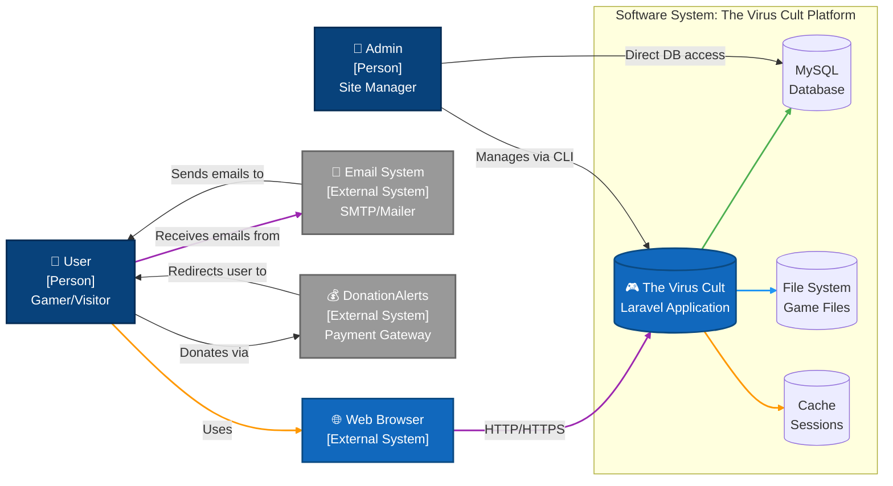

# Контекстная диаграмма

```mermaid
graph LR
    subgraph "Software System: The Virus Cult Platform"
        direction TB
        System[("🎮 The Virus Cult<br/>Laravel Application")]
        System --> DB[(MySQL<br/>Database)]
        System --> FS[(File System<br/>Game Files)]
        System --> Cache[(Cache<br/>Sessions)]
    end

    Person_User["👤 User<br/>[Person]<br/>Gamer/Visitor"]
    Person_Admin["👑 Admin<br/>[Person]<br/>Site Manager"]
    
    System_Email["📧 Email System<br/>[External System]<br/>SMTP/Mailer"]
    System_Donation["💰 DonationAlerts<br/>[External System]<br/>Payment Gateway"]
    System_Browser["🌐 Web Browser<br/>[External System]"]

    %% Interactions
    Person_User -->|Uses| System_Browser
    System_Browser -->|HTTP/HTTPS| System
    
    Person_User -->|Receives emails from| System_Email
    System_Email -->|Sends emails to| Person_User
    
    Person_User -->|Donates via| System_Donation
    System_Donation -->|Redirects user to| Person_User
    
    Person_Admin -->|Manages via CLI| System
    Person_Admin -->|Direct DB access| DB

    %% Labels
    linkStyle 0 stroke:#4CAF50,stroke-width:2px
    linkStyle 1 stroke:#2196F3,stroke-width:2px
    linkStyle 2 stroke:#FF9800,stroke-width:2px
    linkStyle 3 stroke:#FF9800,stroke-width:2px
    linkStyle 4 stroke:#9C27B0,stroke-width:2px
    linkStyle 5 stroke:#9C27B0,stroke-width:2px

    classDef person fill:#08427B,stroke:#052C55,stroke-width:2px,color:#fff
    classDef system fill:#1168BD,stroke:#0B4A82,stroke-width:2px,color:#fff
    classDef external fill:#999999,stroke:#666666,stroke-width:2px,color:#fff
    classDef db fill:#f9f,stroke:#333,stroke-width:2px
    
    class Person_User,Person_Admin person
    class System,System_Browser system
    class System_Email,System_Donation external

```
