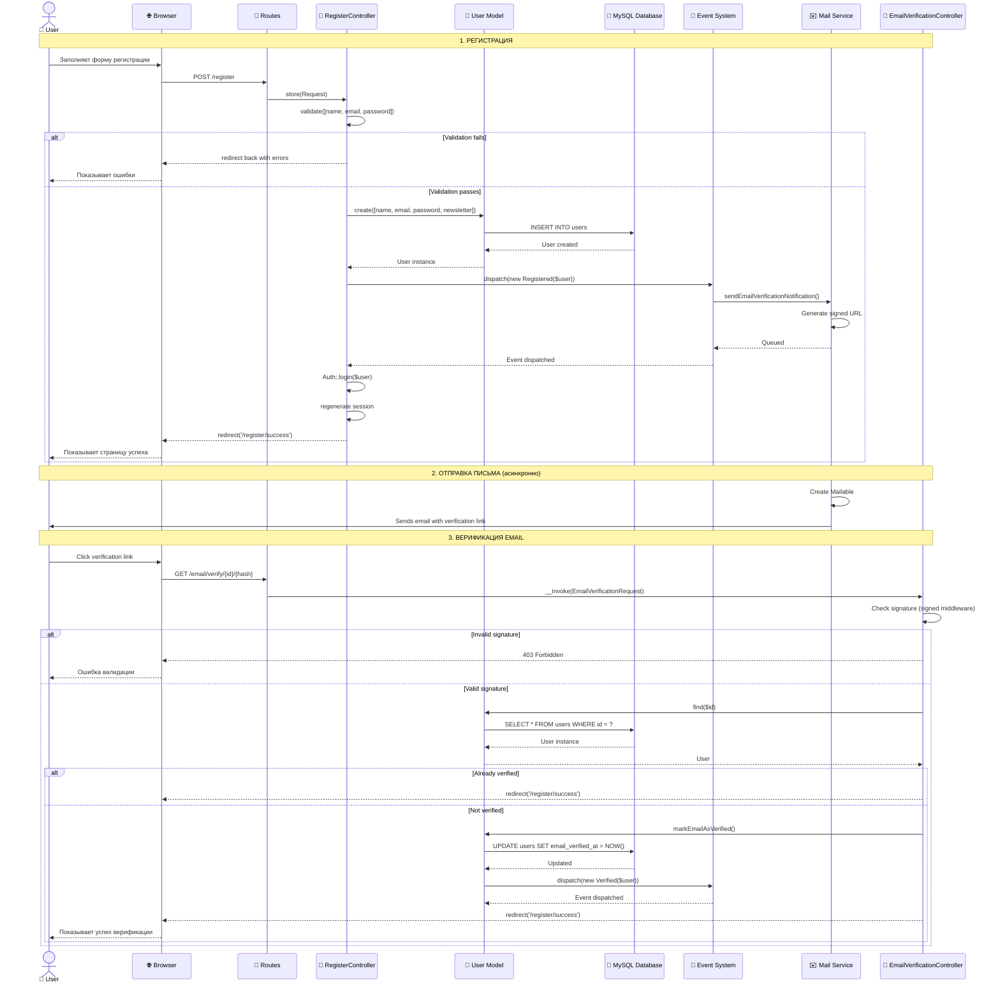

# Sequence-диаграмма

```mermaid
sequenceDiagram
    actor User as 👤 User
    participant Browser as 🌐 Browser
    participant Route as 🚪 Routes
    participant RegisterCtrl as 📝 RegisterController
    participant UserModel as 👥 User Model
    participant DB as 💾 MySQL Database
    participant Event as 📡 Event System
    participant Mail as ✉️ Mail Service
    participant EmailCtrl as 🔗 EmailVerificationController

    Note over User,EmailCtrl: 1. РЕГИСТРАЦИЯ
    
    User->>Browser: Заполняет форму регистрации
    Browser->>Route: POST /register
    Route->>RegisterCtrl: store(Request)
    
    RegisterCtrl->>RegisterCtrl: validate([name, email, password])
    
    alt Validation fails
        RegisterCtrl-->>Browser: redirect back with errors
        Browser-->>User: Показывает ошибки
    else Validation passes
        RegisterCtrl->>UserModel: create([name, email, password, newsletter])
        UserModel->>DB: INSERT INTO users
        DB-->>UserModel: User created
        UserModel-->>RegisterCtrl: User instance
        
        RegisterCtrl->>Event: dispatch(new Registered($user))
        Event->>Mail: sendEmailVerificationNotification()
        Mail->>Mail: Generate signed URL
        Mail-->>Event: Queued
        Event-->>RegisterCtrl: Event dispatched
        
        RegisterCtrl->>RegisterCtrl: Auth::login($user)
        RegisterCtrl->>RegisterCtrl: regenerate session
        
        RegisterCtrl-->>Browser: redirect('/register/success')
        Browser-->>User: Показывает страницу успеха
    end

    Note over User,EmailCtrl: 2. ОТПРАВКА ПИСЬМА (асинхронно)
    
    Mail->>Mail: Create Mailable
    Mail->>User: Sends email with verification link
    
    Note over User,EmailCtrl: 3. ВЕРИФИКАЦИЯ EMAIL
    
    User->>Browser: Click verification link
    Browser->>Route: GET /email/verify/{id}/{hash}
    Route->>EmailCtrl: __invoke(EmailVerificationRequest)
    
    EmailCtrl->>EmailCtrl: Check signature (signed middleware)
    
    alt Invalid signature
        EmailCtrl-->>Browser: 403 Forbidden
        Browser-->>User: Ошибка валидации
    else Valid signature
        EmailCtrl->>UserModel: find($id)
        UserModel->>DB: SELECT * FROM users WHERE id = ?
        DB-->>UserModel: User instance
        UserModel-->>EmailCtrl: User
        
        alt Already verified
            EmailCtrl-->>Browser: redirect('/register/success')
        else Not verified
            EmailCtrl->>UserModel: markEmailAsVerified()
            UserModel->>DB: UPDATE users SET email_verified_at = NOW()
            DB-->>UserModel: Updated
            UserModel->>Event: dispatch(new Verified($user))
            Event-->>UserModel: Event dispatched
            
            EmailCtrl-->>Browser: redirect('/register/success')
            Browser-->>User: Показывает успех верификации
        end
    end

```
