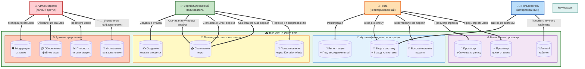

# Use cases диаграмма

```mermaid
flowchart TB
    subgraph System["🎮 THE VIRUS CULT APP"]
        
        subgraph Auth["🔐 Аутентификация и регистрация"]
            direction LR
            A1[("📝 Регистрация<br/>+ Подтверждение email")]
            A2[("🔑 Вход в систему<br/>+ Выход из системы")]
            A3[("🔄 Восстановление<br/>пароля")]
        end
        
        subgraph Browsing["🌐 Навигация и просмотр"]
            B1[("📄 Просмотр<br/>публичных страниц")]
            B2[("👤 Личный<br/>кабинет")]
            B3[("⭐ Просмотр<br/>чужих отзывов")]
        end
        
        subgraph Interaction["💬 Взаимодействие с контентом"]
            I1[("✍️ Создание<br/>отзыва и оценки")]
            I2[("📥 Скачивание<br/>игры")]
            I3[("💝 Пожертвования<br/>через DonationAlerts")]
        end
        
        subgraph Management["⚙️ Администрирование"]
            M1[("🛡️ Модерация<br/>отзывов")]
            M2[("📦 Обновление<br/>файлов игры")]
            M3[("📊 Просмотр<br/>логов и метрик")]
            M4[("👥 Управление<br/>пользователями")]
        end
        
    end

    Guest["👤 Гость<br/>(неавторизованный)"]
    User["👨‍💻 Пользователь<br/>(авторизованный)"]
    Verified["✅ Верифицированный<br/>пользователь"]
    Admin["👑 Администратор<br/>(полный доступ)"]

    %% Гость
    Guest ==>|"Регистрация"| A1
    Guest ==>|"Вход в систему"| A2
    Guest ==>|"Восстановление пароля"| A3
    Guest ==>|"Просмотр страниц"| B1
    Guest ==>|"Просмотр отзывов"| B3
    
    %% Пользователь (наследует права гостя)
    User ==>|"Выход из системы"| A2
    User ==>|"Просмотр личного кабинета"| B2
    
    %% Верифицированный пользователь (наследует права пользователя)
    Verified ==>|"Создание отзыва"| I1
    Verified ==>|"Скачивание Windows версии"| I2
    Verified ==>|"Скачивание Linux версии"| I2
    Verified ==>|"Скачивание Mac версии"| I2
    Verified ==>|"Переход к пожертвованию"| I3
    
    %% Администратор
    Admin ==>|"Модерация отзывов"| M1
    Admin ==>|"Обновление файлов"| M2
    Admin ==>|"Просмотр логов"| M3
    Admin ==>|"Управление пользователями"| M4

    %% Стилизация
    style System fill:#E8F5E9,stroke:#2E7D32,stroke-width:3px
    style Guest fill:#FFE0B2,stroke:#E65100,stroke-width:2px
    style User fill:#BBDEFB,stroke:#0D47A1,stroke-width:2px
    style Verified fill:#C8E6C9,stroke:#1B5E20,stroke-width:2px
    style Admin fill:#FFCDD2,stroke:#B71C1C,stroke-width:2px
    
    style Auth fill:#E3F2FD,stroke:#1976D2,stroke-width:1px
    style Browsing fill:#F3E5F5,stroke:#7B1FA2,stroke-width:1px
    style Interaction fill:#FFF9C4,stroke:#F57F17,stroke-width:1px
    style Management fill:#FFCCBC,stroke:#BF360C,stroke-width:1px
    style ReviewOwn fill:#E0F2F1,stroke:#00695C,stroke-width:1px
```
